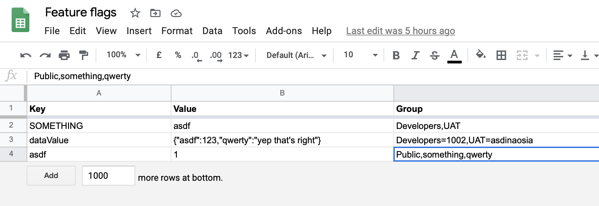

# Google Sheets as a feature toggle engine running on Cloud Run

I might be stingier than most, but if there is a modern core service that should be free and configurable it's feature toggles. You'll quickly find such SaaS services can cost quite some money, and also be pretty slow. This repo gives you more or less all of the pieces to construct your own feature toggle engine, with Cloud Run (fast, almost free, serverless) and Google Sheets (easy to use, convenient, familiar).

The Node application is just two MJS files. For the webserver part, I am using [Fastify](https://github.com/fastify/fastify). For the actual spreadsheet handling, I'm leveraging the [`google-spreadsheets`](https://github.com/theoephraim/node-google-spreadsheet) library which eases the use of the original Google Sheets API. The app gets packaged with [Docker](https://www.docker.com) in the CI step.

In addition to the feature toggle application itself, you get the full CI/CD monty here:

- Store source code in [Cloud Source Repositories](https://cloud.google.com/source-repositories)
- Store secrets (environment variables) in [Secret Manager](https://cloud.google.com/secret-manager)
- Build code in [Cloud Build](https://cloud.google.com/cloud-build)
- Store application image in [Artifact Registry](https://cloud.google.com/artifact-registry)
- Deploy app as a serverless container on [Cloud Run](https://cloud.google.com/run)

The toggle format is inspired by [Azure App Config](https://azure.microsoft.com/en-us/services/app-configuration/) and their toggles.

**Notes**

To use this repo, you will need to have a Google Sheets document with the correct formatting (three headers: `Key`, `Value`, `Group`). There is also a limit of one (1) page. The first page will be picked from your document when trying to access your toggles. Currently there is a hard-coded limit of 100 rows when it's trying to map your toggles. If you want more, go ahead and raise it in `GoogleSheetsFeatureToggles.mjs`, as per:

```
return await sheet.getRows({
  offset: 0,
  limit: 100 // <----- Change this if needed
});
```

## Prerequisites

- You have a Google Cloud account
- You are logged in, on Google Cloud Platform
- You have credentials that can deploy and run applications on Cloud Run (including building them on Cloud Build and using any of the other services listed above)
- You have a service account set up for Google Sheets, and ensured that the service account is invited to your Google Sheets "feature toggles" document (follow steps in the section `How to set up your Google Sheets document`)
- You've put in your own variables and settings in `scripts/vars.sh`

## Usage example

```
GET https://YOUR_APP.a.run.app?sheet={GOOGLE_SHEETS_DOCUMENT_ID}&toggles={COMMA_SEPARATED_LIST_OF_KEYS}
{
  "toggles": [
    {
      "name": "My toggle",
      "value": "{\"something\":123,\"somethingElse\":\"yep\"}",
      "groups": [
        {
          "name": "Developers",
          "rolloutPercentage": 100
        },
        {
          "name": "UAT",
          "rolloutPercentage": 50
        }
      ]
    },
    {
      "name": "Some other toggle",
      "value": "1",
      "groups": [
        {
          "name": "Developers",
          "rolloutPercentage": 100
        },
        {
          "name": "UAT",
          "rolloutPercentage": 100
        }
        {
          "name": "Public",
          "rolloutPercentage": 5
        }
      ]
    }
  ],
  "fetchedAt": 1606639639167
}
```

## How to set up your Google Sheets document

To use this repo, you will need to have a Google Sheets document with the correct formatting (three headers: `Key`, `Value`, `Group`).

Refer to the below, for a (very basic!) formatting example:



## How to set rollout percentage on groups

You can set your "rollout percentage" by adding `={PERCENTAGE}` after a group name, like this: `Developers=50` (would mean the Developers group gets 50% rollout). Add more groups by comma-separating them, like: `Developers,UAT=50`. If a rollout percentage is missing like in the just-mentioned example, a value of `100` is automatically added.

## How to set up your service account

### Create service account

Follow the guide at [https://theoephraim.github.io/node-google-spreadsheet/#/getting-started/authentication?id=service-account](https://theoephraim.github.io/node-google-spreadsheet/#/getting-started/authentication?id=service-account) to understand how to create a service account and get your 1) _private key_ and 2) _unique service account email_.

### Add values to local env + Secret Manager

Once you have the values, put them in `scripts/init.sh` (you will need the values to be exported to Secret Manager); look for the `gcloud secrets create` commands to find the spot.

For local development you will need to export them, or do something like the below (with your values) inside of your application code:

```
process.env.GOOGLE_SERVICE_ACCOUNT_EMAIL = 'email';
process.env.GOOGLE_PRIVATE_KEY = 'key';
```

### Invite service account email to document

Finally, invite the service account email to your Google Sheets document to grant access.

## Suggestion: Cache your toggles

You should cache your toggles so you don't have wait every time you request them. A `fetchedAt` key comes with the response object, so you could use that if you wanted to cache toggles locally.

## Install

Run `npm install` or `yarn install`.

## Develop

Run `npm start` in the `src` folder. You'll need to have `GOOGLE_SERVICE_ACCOUNT_EMAIL` and `GOOGLE_PRIVATE_KEY` in `process.env` for the application to work.

Considering that it's a very simple Node app with a Fastify webserver running it locally like that probably won't pose a problem. If you're more of a Docker kind-of-person, you should know that Docker is not currently set up for local development—you'll have to do that on your own if you really want it.

## Deploy

Set the required `PROJECT_ID` variable in `scripts/vars.sh` to your project ID, then export all the variables. Then run `sh scripts/init.sh` to set up all of the infrastructure and do the first build.

## What if I don't want to have all the infra, kind of something more light-weight...?

You should be able to "just" use Cloud Build to build and deploy the app on Cloud Run, if you run `sh scripts/build.sh`.

## Continuous integration, building, deploying

If you ran the `init.sh` script, you should have everything set up for modern CI/CD, meaning you'd only need to commit and push this code to the repository and it'll be built and deployed as soon as it's done.

## Delete or "tear down" the project

Run `sh scripts/teardown.sh` and most of your infrastructure should soon be gone. Check for any straggling cloud storage buckets, though.

## References

- [https://cloud.google.com/cloud-build/docs/securing-builds/use-encrypted-secrets-credentials](https://cloud.google.com/cloud-build/docs/securing-builds/use-encrypted-secrets-credentials)
- [https://docs.docker.com/engine/reference/commandline/build/](https://docs.docker.com/engine/reference/commandline/build/)
- [https://cloud.google.com/cloud-build/docs/securing-builds/configure-access-for-cloud-build-service-account](https://cloud.google.com/cloud-build/docs/securing-builds/configure-access-for-cloud-build-service-account)
- [https://cloud.google.com/secret-manager/docs/quickstart#secretmanager-quickstart-cli](https://cloud.google.com/secret-manager/docs/quickstart#secretmanager-quickstart-cli)
- [https://cloud.google.com/cloud-build/docs/configuring-builds/run-bash-scripts](https://cloud.google.com/cloud-build/docs/configuring-builds/run-bash-scripts)
- [https://vsupalov.com/docker-arg-env-variable-guide/](https://vsupalov.com/docker-arg-env-variable-guide/)
